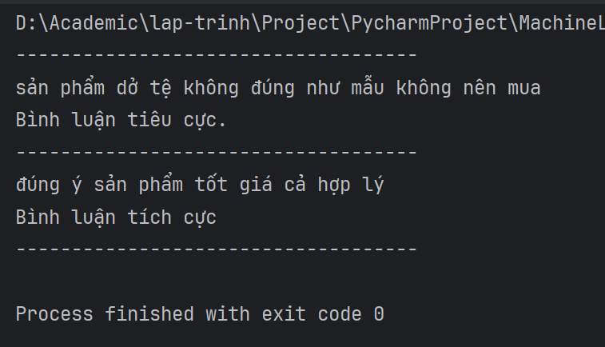

# Phát Hiện Trạng Thái Comment
Using machine learning

1, Hướng dẫn cài đặt

    1, cài đặt pycharm 
    2, cài các thư viện trong môi trường ảo (.venv)
    3, chạy chương trình

2, Kết quả trả về

